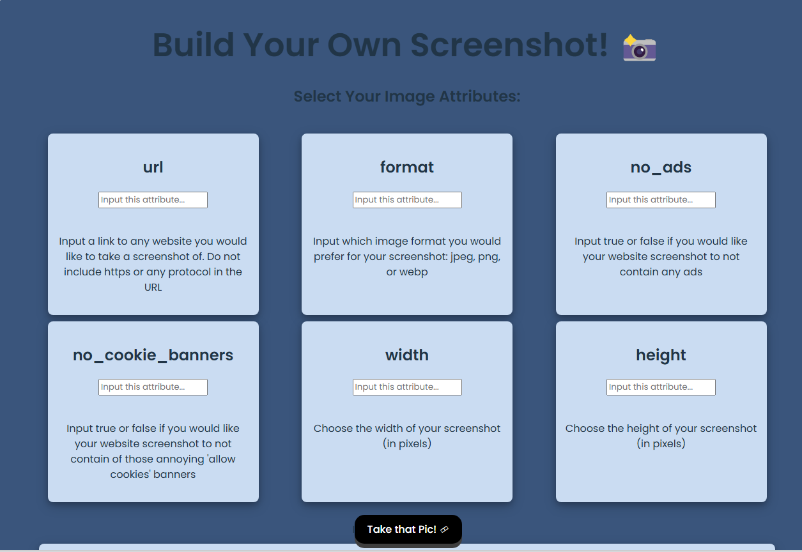
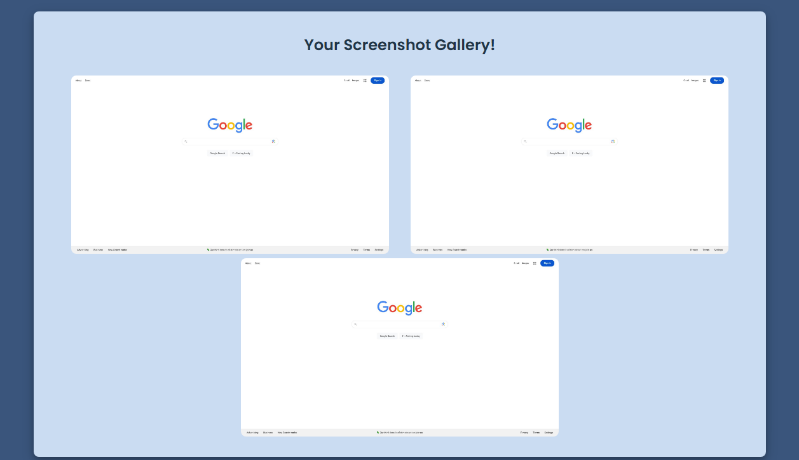

# Lab 4




**Step 0: Set up**

In this step, we'll create our new Vite project and get used to the APIFlash API we need for this lab!

Go to the [APIFlash website](https://apiflash.com/)
 and make a free account with your email. After making a free account, 
the website will make a first free access key for you. Go to the **Access Keys** tab in order to see it.

Go to the APIFlash [query builder](https://apiflash.com/dashboard/query_builder)
 and play around making a few queries so that you understand how exactly
 this API works. Read through each parameter definition and take notes 
of which parameters you would like to include for users to control in 
later steps!

🥶 *Potential Blocker*: Each ApiFlash account is limited to 100 
queries per month. If you run out of queries, you can create another 
account using the unlimited Gmail account trick of adding + and then 
incrementing numbers after the, e.g. [xyz@gmail.com](mailto:xyz@gmail.com) becomes [xyz+1@gmail.com](mailto:xyz+1@gmail.com), [xyz+2@gmail.com](mailto:xyz+2@gmail.com) etc.

Create a new React project. To do this, run the command `npm create vite@latest cap`.

Follow the prompts and instructions the Terminal gives you. This project will be with the React framework in Javascript.

In your Terminal, run the following commands:

`cd cap
npm install
npm run dev`

**💡 Tip:** Running `npm run dev` will start up a server that stays active and constantly updates your project as you type. If you want to quit this behavior, press `ctrl + c`.

Open up `App.jsx` in your newly created project and remove everything inside the `return` statement so that when you check your local running version of the app, there is nothing there.

Delete the line below from the top of the file:

`import reactLogo from './assets/react.svg'`

We will also need to bring our APIFlash access key into our project so that the app can use our APIFlash account.

- Create a new file called `.env` in your `cap` folder.
- Create a environment variable called `VITE_APP_ACCESS_KEY` that is set to your access key between the quotation marks.`VITE_APP_ACCESS_KEY = "your_key_here"`
- Then, back in `App.jsx`, create a variable called `ACCESS_KEY` at the top of the file under the `import` statements that is set to the environment variable `VITE_APP_ACCESS_KEY`.

`const ACCESS_KEY = import.meta.env.VITE_APP_ACCESS_KEY;`

### Step 1: Create your form for user input on the screenshot attributes

In this step, we want to make the form that users will use in order to establish some base qualities about their screenshots.

We first want to establish that there is a set of inputs that we will be asking each user to specify for their screenshot.

Add these in a state variable dictionary in `App.jsx`. Feel free to add more inputs or change out some of the ones here, however you **need** to have the `url`, `width`, and `height` input values.

```jsx
const [inputs, setInputs] = useState({
  url: "",
  format: "",
  no_ads: "",
  no_cookie_banners: "",
  width: "",
  height: "",
});
```

Create a `components` folder. Inside your `components` folder, create a file called `APIForm.jsx`.

```jsx
const APIForm = () => {

  return (
    <div>
      <h2> Select Your Image Attributes: </h2>
      <form className="form-container">
        
      </form>
    </div>
  );
};

export default APIForm;
```

We will be using regular text boxes, so all we'll need to do is loop through our `inputs` and display those titles with an `input` tag below them.

`inputs` is an object. It's initialized with a state value that is an object containing several properties (`url`, `format`, `no_ads`, `no_cookie_banners`, `width`, `height`), each of which has an initial value of an empty string `""`.

```jsx
import React from "react";

const APIForm = ({ inputs, handleChange, onSubmit }) => {
    const inputsInfo = {
        url: "Input a link to any website you would like to take a screenshot of. Do not include https or any protocol in the URL",
        format: "Input which image format you would prefer for your screenshot: jpeg, png, or webp",
        no_ads: "Input true or false if you would like your website screenshot to not contain any ads",
        no_cookie_banners: "Input true or false if you would like your website screenshot to not contain of those annoying 'allow cookies' banners",
        width: "Choose the width of your screenshot (in pixels)",
        height: "Choose the height of your screenshot (in pixels)"
    };

    return (
        <div>
            <h2> Select Your Image Attributes: </h2>
            <form className="form-container">
                {inputs &&
                    Object.entries(inputs).map(([category, value], index) => (
                        <li className="form" key={index}>
                            <h2>{category} </h2>
                            <input
                                type="text"
                                name={category}
                                value={value}
                                placeholder="Input this attribute..."
                                onChange={handleChange}
                                className="textbox"
                            />
                            <br></br>
                            <br></br>
                            <p> {inputsInfo[category]}</p>
                        </li>
                    ))}
            </form>I

            <button type="submit" className="button" onClick={onSubmit}>
                Take that Pic! 🎞
            </button>
        </div>
    );
};

export default APIForm;
```

- `Object.entries(inputs).map()` is used to iterate through the key-value pairs in the `inputs` object. `Object.entries()` returns An array of property arrays, each of which holds a property name and the corresponding value
- Each key-value pair is represented by `[category, value]`, and `index` is the index of the current pair in the array of entries.
- For each key-value pair, a `li` element with a `className` of `"form"` is created.
- The HTML `<input>` element is used to create interactive controls for web-based forms in order to accept data from the user. The most common use is for text input, where users can type text into a field. `<input type="text" name="username" placeholder="Enter your username">` An `onChange` handler called `handleChange` is assigned to the `input` element to handle user input.
- **Note:** The reason we cannot make `inputsInfo` a dictionary with keys representing each of the inputs is that in our `.map()` function, we can only access one dictionary object at a time. In this case, it is our `inputs` state variable. Therefore, we have to make this an array and utilize the `index` looping variable in our `.map()` (which is why it is important that your `inputsInfo` has the descriptions in the same order the inputs show up in). —> this sounds wrong
- When mapping through the entries of `inputs` to generate JSX elements, you're relying on the order of `inputsInfo` to provide additional information for each input field. The order in `inputsInfo` corresponds to the order of entries in `inputs`. However, it's worth noting that JavaScript objects do not guarantee order of properties, especially when the keys are not numeric or were not added in a consistent order.  A better approach might be to structure `inputsInfo` as an object where keys match those of `inputs`, `inputsInfo[category]` will fetch the relevant info for each input based on its key, ensuring a reliable match between each input and its description.
- 

And lastly, let's use our `APIForm` component in `App.jsx` so that we can see it! In `App.jsx` let's import this file at the top:

`import APIForm from './Components/APIform';`

```jsx
return (
    <div className="whole-page">
      <h1>Build Your Own Screenshot! 📸</h1>
      
      <APIForm
        inputs={inputs}
        handleChange={(e) =>
          setInputs((prevState) => ({
            ...prevState,
            [e.target.name]: e.target.value.trim(),
          }))
        }
        onSubmit={submitForm}
      />
      <br></br>

    </div>
  );
}

export default App
```

- `{...prevState,}` is using the spread syntax to create a shallow copy of the `prevState` object. This ensures that the other properties of `prevState` remain unchanged, adhering to the principle of immutability in React.
- `[e.target.name]: e.target.value.trim()` is using a computed property name to set the value of a specific property in the new state object. `e.target.name` gets the `name` attribute of the input element that triggered the event. `e.target.value` gets the current value of the input element, and `trim()` removes any leading or trailing whitespace from that value.

**Step 2: Make the query with the user input, create an API call, and display your screenshot**

In this step, we want to take our user inputs, do some input/error handling with them, and then make our API call to display our created image!

Let's include some default values that are automatically assigned when our input values for those parameters are checked and empty.

```jsx
const submitForm = () => {
    let defaultValues = {
      format: "jpeg",
      no_ads: "true",
      no_cookie_banners: "true",
      width: "1920",
      height: "1080",
    };

    if (inputs.url == "" || inputs.url == " ") {
      alert("You forgot to submit an url!");
    } else {
      for (const [key, value] of Object.entries(inputs)) {
        if (value == "") {
          inputs[key] = defaultValues[key]
        }
      }
      makeQuery();
    }
  }
```

We also want to make sure that there is a `url` provided by the user. If there is no url, the API query should not be made and we should let the user know using `alert()`.

- **URL Validation**:
    - The function checks whether the `url` property in the `inputs` object is either an empty string or a string containing a single space. If so, it alerts the user with the message "You forgot to submit an url!".
- **Setting Default Values**:
    - If the `url` property is valid (i.e., not an empty string or a single space), the function then iterates through all the key-value pairs in the `inputs` object using a `for...of` loop along with `Object.entries`.
    - Within the loop, it checks if the value of the current key-value pair is an empty string (`""`). If so, it updates the `inputs` object to set the value for that key to the corresponding default value from the `defaultValues` object.

Why directly manipulate inputs instead of using setInputs() 

```jsx
let updatedInputs = { ...inputs };  // Create a shallow copy of inputs
      for (const [key, value] of Object.entries(inputs)) {
        if (value == "") {
          updatedInputs[key] = defaultValues[key];  // Update the copy, not the original state
        }
      }
      setInputs(prevInputs => ({
        ...prevInputs,
        ...updatedInputs,
      }));

      console.log(updatedInputs);
```

In this version of `submitForm`, a shallow copy of the `inputs` object is created and updated, and then `setInputs`  is used to update the state with the new object. 

The `setInputs` function is asynchronous, which means it does not immediately update the state but schedules the update to be performed later. Therefore, when `makeQuery` is called immediately after `setInputs`, the `inputs` state may not have been updated yet.

Next, create a helper function called `makeQuery()`. We'll use this function to take our input values and assemble them into the right query string format that our API call needs.

```jsx
const makeQuery = () => {
    let wait_until = "network_idle";
    let response_type = "json";
    let fail_on_status = "400%2C404%2C500-511";
    let url_starter = "https://";
    let fullURL = url_starter + inputs.url;

    let query = `https://api.apiflash.com/v1/urltoimage?access_key=${ACCESS_KEY}&url=${fullURL}&format=${inputs.format}&width=${inputs.width}&height=${inputs.height}&no_cookie_banners=${inputs.no_cookie_banners}&no_ads=${inputs.no_ads}&wait_until=${wait_until}&response_type=${response_type}&fail_on_status=${fail_on_status}`;

    callAPI(query).catch(console.error);
  }
```

The next function we will need is our async function to make our API call with our newly created query, `callAPI()`. We will also need a state variable to hold and display the screenshot after we make our API call.

```jsx
const callAPI = async (query) => {
    const response = await fetch(query);
    const json = await response.json();
    if (json.url == null) {
      alert("Oops! Something went wrong with that query, let's try again!")
    }
    else {
      console.log("achieved image url", json.url)
      // console.log(JSON.stringify(json))
      setCurrentImage(json.url);
      reset();
    }
  }
```

Create a state variable to hold and display the current screenshot. `null` is a value that represents no value or no object

```jsx
const [currentImage, setCurrentImage] = useState(null);
```

To give more information to our users, check if we didn't receive a URL back from our API call (meaning a proper screenshot couldn't be taken), and display a message to the user with `alert()`. If we do get a URL back, make it our `currentImage`.

Finally, create another helper function called `reset()`. In this function, set the current `inputs` values to `""` so that our form is cleared after our API call.

Lastly, we want to allow users to see a few things from the web page to show them their resulting screenshot and how their query is progressing based on their inputs in case they are interested.

```jsx
			<div className="container">
        <h3> Current Query Status: </h3>
        <p>
          https://api.apiflash.com/v1/urltoimage?access_key=ACCESS_KEY
          <br></br>
          &url={inputs.url} <br></br>
          &format={inputs.format} <br></br>
          &width={inputs.width}
          <br></br>
          &height={inputs.height}
          <br></br>
          &no_cookie_banners={inputs.no_cookie_banners}
          <br></br>
          &no_ads={inputs.no_ads}
          <br></br>
        </p>
      </div>

      <br></br>

      {currentImage ? (
        
      ) : (
        <div> </div>
      )}

      <br></br>
```

**Step 3: Create gallery for displaying previous screenshots**

We know that we will need to keep track of all of the images we have taken. Create a state variable for this in `App.jsx`.

`const [prevImages, setPrevImages] = useState([]);`

We need to update this state variable whenever we get a new image, so let's update this variable in our `callAPI()` function.

```jsx
const callAPI = async (query) => {
    const response = await fetch(query);
    const json = await response.json();
    if (json.url == null) {
      alert("Oops! Something went wrong with that query, let's try again!")
    }
    else {
      console.log("achieved image url", json.url)
      // console.log(JSON.stringify(json))
      setCurrentImage(json.url);
      setPrevImages((images) => [...images, json.url]);
      reset();
    }
  }
```

This function argument takes the previous state (`images`) as its parameter, and returns a new array containing all the elements from the previous state plus the new image URL (`json.url`)

Create a new file called `Gallery.jsx` in your `components` folder for a new `Gallery` component. Now that we know that we have an array of images, we can add that in as a prop we expect.

```jsx
{images && images.length > 0 ? (
  // ...
) : (
  // ...
)}
```

- Curly braces are used to evaluate JavaScript expressions within JSX. When you want to insert a JavaScript expression within your JSX markup, you wrap the expression in curly braces.
- In your given code snippet, curly braces are used to evaluate the expression `images && images.length > 0`, which checks if the `images` array exists and has at least one item.
- Parentheses are used to group expressions and return a single expression. They can be useful for returning multiple lines of JSX while keeping it readable and well-formatted.

```jsx
const Gallery = ({ images }) => {

    return (
        <div>
            <h2> Your Screenshot Gallery!</h2>
            <div className="image-container">
                {images && images.length > 0 ? (

                    images.map((pic, index) => (
                        <li className="gallery" key={index}>
                            
                        </li>
                    ))

                ) : (
                    <div>
                        <h3>You haven't made a screenshot yet!</h3>
                    </div>
                )
                }
            </div>

        </div>
    );
};

export default Gallery;
```

- **Mapping Over Images**:
    - `images.map((pic, index) => ( ... ))`
    - This line maps over each image in the `images` array, using the `map()` method, and returns a list item (`li`) for each image.

Lastly, we need to import the `Gallery` component in our `App.jsx` file.

`import Gallery from './Components/gallery';`

Add the component to the bottom of our `return` statement below your `Current Query Status`:

```jsx
<div className="container">
  <Gallery images={prevImages} />
</div>
```

**Step 4: Add styling with CSS**

```jsx
/* Importing the font 'Poppins' from Google Fonts */
@import url('https://fonts.googleapis.com/css2?family=Poppins:wght@300;400;500;600&display=swap');

/* Styling for the root element, typically the <div id="root"></div> in React applications */
#root {
  max-width: 1280px; /* Sets the maximum width */
  margin: 0 auto; /* Centers the element horizontally */
  padding: 2rem; /* Adds padding around the element */
  text-align: center; /* Aligns text to the center */
  font-family: 'Poppins', sans-serif; /* Sets the font family */
}

/* Resets the list style for all <li> elements */
li {
  list-style: none; /* Removes the default list bullet */
}

/* Specific styling for <li> elements with class 'form' */
li.form {
  padding: 15px; /* Adds padding */
  box-shadow: 0 4px 8px 0 rgba(0, 0, 0, 0.2), 0 6px 20px 0 rgba(0, 0, 0, 0.19); /* Adds shadow */
  margin: 5px; /* Adds margin */
  border-radius: 8px; /* Rounds the corners */
  background-color: #cadcf2; /* Sets background color */
  width: 300px; /* Sets width */
}

/* Styling for all <input> elements */
input {
  font-family: 'Poppins'; /* Sets the font family */
}

/* Styling for elements with class 'form-container' */
.form-container {
  display: flex; /* Sets up a flex container */
  justify-content: space-evenly; /* Distributes items evenly */
  align-items: stretch; /* Stretches items to fill the container */
  position: relative; /* Sets position context for absolutely positioned children */
  padding: 15px; /* Adds padding */
  flex-wrap: wrap; /* Allows flex items to wrap onto multiple lines */
}

/* Styling for elements with class 'image-container' */
.image-container {
  display: flex; /* Sets up a flex container */
  justify-content: space-evenly; /* Distributes items evenly */
  padding: 10px; /* Adds padding */
  flex-wrap: wrap; /* Allows flex items to wrap onto multiple lines */
}

/* Styling for elements with class 'whole-page' */
.whole-page {
  background-color: rgba(37, 67, 110, 0.9); /* Sets background color */
  border-radius: 10px; /* Rounds the corners */
  padding-top: 10px; /* Adds padding to the top */
  padding-bottom: 10px; /* Adds padding to the bottom */
  box-shadow: 0 4px 8px 0 rgba(0, 0, 0, 0.2), 0 6px 20px 0 rgba(0, 0, 0, 0.19); /* Adds shadow */
  margin-top: 15px; /* Adds margin to the top */
}

/* Styling for elements with class 'button' */
.button {
  color: #fff; /* Sets text color */
  background-color:black; /* Sets background color */
  border: none; /* Removes border */
  border-radius: 15px; /* Rounds the corners */
  box-shadow: 0 7px rgb(62, 62, 62); /* Adds shadow */
}

/* Styling for elements with class 'button' on hover */
.button:hover {
  background-color: #1a1a1a; /* Changes background color on hover */
}

/* Styling for elements with class 'button' on active (when clicked) */
.button:active {
  background-color: #0b0b0b; /* Changes background color when clicked */
  box-shadow: 0 3px #666; /* Changes shadow when clicked */
  transform: translateY(4px); /* Slightly moves button down when clicked */
}

/* Styling for elements with class 'container' */
.container {
  padding: 15px; /* Adds padding */
  box-shadow: 0 4px 8px 0 rgba(0, 0, 0, 0.2), 0 6px 20px 0 rgba(0, 0, 0, 0.19); /* Adds shadow */
  margin-left: 5%; /* Adds margin to the left */
  margin-right: 5%; /* Adds margin to the right */
  border-radius: 8px; /* Rounds the corners */
  background-color: #cadcf2; /* Sets background color */
}

/* Styling for elements with class 'screenshot' */
.screenshot {
  max-width: 90%; /* Sets the maximum width */
  margin-bottom: 20px; /* Adds margin to the bottom */
  border-radius: 8px; /* Rounds the corners */
}

/* Styling for elements with class 'gallery-screenshot' */
.gallery-screenshot {
  border-radius: 8px; /* Rounds the corners */
}
```

**Step 5: Add a query quota reminder to the top of your webpage**

```jsx
const [quota, setQuota] = useState(null);

const getQuota = async () => {
    const response = await fetch("https://api.apiflash.com/v1/urltoimage/quota?access_key=" + ACCESS_KEY);
    const result = await response.json();
  
    setQuota(result);
  }
```

Let's call `getQuota()` at the end of `callAPI()` so every time that we make an API call, we also update our quota numbers

```jsx
. 
.
.
else {
  setCurrentImage(json.url);
  setPrevImages((images) => [...images, json.url]);
  reset();
  getQuota();
}
```

The `quota` response that will be returned by this API call will be a small dictionary with keys for the original limit, remaining calls, and when your limit resets (in UTC epoch seconds aka the number of seconds that have passed since January 1, 1970 until the day your quota actually resets 😂).

```jsx
{quota ? (
  <p className="quota">
    {" "}
    Remaining API calls: {quota.remaining} out of {quota.limit}
  </p>
) : (
  <p></p>
)}
```

And lastly, we can include some CSS so that it is fixed in the top right of our screen in white text (feel free to change the color for however you need it)

```jsx
.quota {
  position: absolute;
  right: 0;
  top: 0;
  margin: 10px;
  color: blue;
}
```
